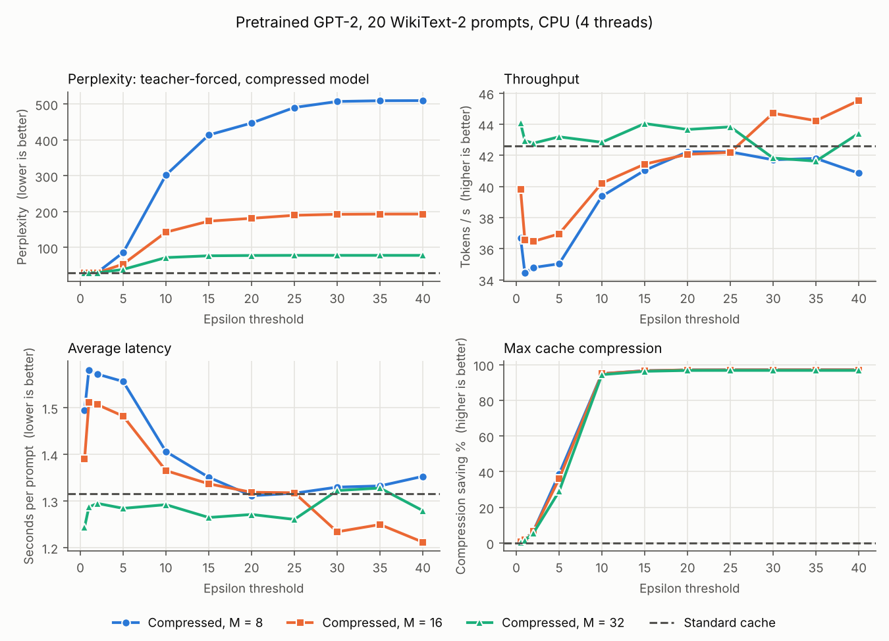
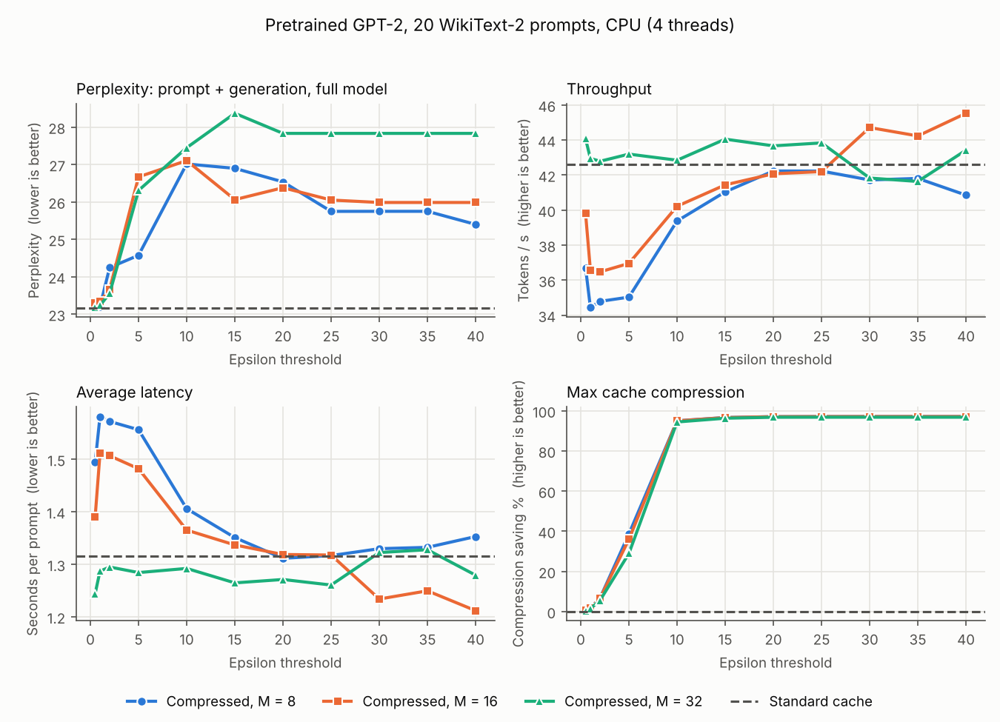

# Example results: pretrained GPT-2, 20 prompts, CPU

A reference run of this code, meant as a sanity check for your own runs. It is **not** a replication of the paper's numbers.
The model is pretrained `gpt2`, not fine-tuned on WikiText-2. The run used 20 prompts instead of 100 and a 4-thread
CPU instead of an NVIDIA L40S.

```bash
python -m graphkv.run --model gpt2 --num-prompts 20 --intervals 8,16,32 --threads 4 --output-dir results/gpt2_20
python -m graphkv.plot results/gpt2_20
```

Environment: Python 3.13, PyTorch 2.14.1 (CPU), transformers 5.19.0, Linux x86-64, 4 threads. All other settings are the
defaults (per-head clustering, `N_sink = 4`, label propagation to convergence, greedy decoding, 50 new tokens, seed 42).
The sweep took 31 minutes, or 2.8 s per (prompt, configuration) pair.

Rerunning gave identical compression, perplexity and prefix-match values (decoding is deterministic). Timings varied
by about ±2 tok/s between runs on this machine.

## Figure 2 equivalent

Perplexity panel showing the strict metric, teacher-forced perplexity of held-out reference text under the compressed model:



The same sweep with the perplexity panel showing `seq_ppl` (prompt + generated text scored by the uncompressed model).
This is the metric whose behaviour resembles the paper's reported perplexities:



## Table I equivalent (M = 16)

| Metric | ε = 10 | ε = 20 | ε = 40 | paper, ε = 10 / 20 / 40 (fine-tuned GPT-2, L40S) |
|---|---|---|---|---|
| Max compression (%) | 94.96 | 97.06 | 97.12 | 83.80 / 97.40 / 97.70 |
| Perplexity, `seq_ppl` (baseline 23.17) | 27.10 | 26.38 | 25.98 | 24.08 / 23.87 / 23.86 (baseline 23.42) |
| Perplexity, `tf_ppl` (baseline 29.15) | 142.69 | 181.34 | 193.24 | not reported |
| Throughput (tokens/s; baseline 42.59) | 40.22 | 42.07 | 45.52 | 199.58 / 207.57 / 209.27 |
| Latency (s per prompt; baseline 1.315) | 1.365 | 1.319 | 1.212 | 0.095 / 0.087 / 0.089 (definition unknown) |

## All configurations

`prefix match` is the fraction of the baseline's 50 greedy tokens reproduced before the first divergence. At large ε it
equals `(M + 1) / 50`: the output diverges at the first token predicted from a compressed cache.

| method | M | ε | max compression % | tf_ppl | seq_ppl | oracle_ppl | prefix match | decode tok/s | latency s | compress ms/call |
|---|---|---|---|---|---|---|---|---|---|---|
| baseline | - | - | 0.0 | 29.2 | 23.17 | 3.00 | 1.00 | 42.6 | 1.315 | 0.0 |
| graphkv | 8 | 0.5 | 0.6 | 29.2 | 23.34 | 3.08 | 0.88 | 36.7 | 1.494 | 29.1 |
| graphkv | 8 | 1.0 | 1.8 | 29.2 | 23.20 | 3.02 | 0.86 | 34.4 | 1.581 | 35.2 |
| graphkv | 8 | 2.0 | 6.7 | 30.7 | 24.25 | 3.57 | 0.46 | 34.8 | 1.572 | 41.1 |
| graphkv | 8 | 5.0 | 38.7 | 85.8 | 24.57 | 3.76 | 0.20 | 35.0 | 1.556 | 40.2 |
| graphkv | 8 | 10.0 | 95.0 | 302.0 | 27.01 | 5.41 | 0.18 | 39.4 | 1.406 | 17.8 |
| graphkv | 8 | 15.0 | 96.6 | 413.6 | 26.90 | 5.32 | 0.18 | 41.0 | 1.351 | 12.3 |
| graphkv | 8 | 20.0 | 97.1 | 447.0 | 26.54 | 5.05 | 0.18 | 42.2 | 1.311 | 10.0 |
| graphkv | 8 | 25.0 | 97.1 | 490.3 | 25.75 | 4.50 | 0.18 | 42.2 | 1.317 | 9.7 |
| graphkv | 8 | 30.0 | 97.1 | 507.1 | 25.75 | 4.50 | 0.18 | 41.7 | 1.330 | 9.5 |
| graphkv | 8 | 35.0 | 97.1 | 509.1 | 25.75 | 4.50 | 0.18 | 41.8 | 1.332 | 9.4 |
| graphkv | 8 | 40.0 | 97.1 | 509.5 | 25.40 | 4.27 | 0.18 | 40.9 | 1.353 | 9.8 |
| graphkv | 16 | 0.5 | 0.5 | 29.2 | 23.30 | 3.07 | 0.90 | 39.8 | 1.391 | 23.2 |
| graphkv | 16 | 1.0 | 1.8 | 29.1 | 23.34 | 3.08 | 0.86 | 36.6 | 1.511 | 32.0 |
| graphkv | 16 | 2.0 | 6.7 | 29.6 | 23.66 | 3.25 | 0.60 | 36.5 | 1.507 | 40.6 |
| graphkv | 16 | 5.0 | 36.0 | 53.6 | 26.67 | 5.15 | 0.36 | 37.0 | 1.482 | 45.2 |
| graphkv | 16 | 10.0 | 95.0 | 142.7 | 27.10 | 5.47 | 0.34 | 40.2 | 1.365 | 23.9 |
| graphkv | 16 | 15.0 | 96.6 | 173.3 | 26.06 | 4.71 | 0.34 | 41.4 | 1.337 | 15.5 |
| graphkv | 16 | 20.0 | 97.1 | 181.3 | 26.38 | 4.93 | 0.34 | 42.1 | 1.319 | 13.0 |
| graphkv | 16 | 25.0 | 97.1 | 189.7 | 26.05 | 4.70 | 0.34 | 42.2 | 1.318 | 12.8 |
| graphkv | 16 | 30.0 | 97.1 | 192.5 | 25.98 | 4.66 | 0.34 | 44.7 | 1.234 | 12.6 |
| graphkv | 16 | 35.0 | 97.1 | 193.2 | 25.98 | 4.66 | 0.34 | 44.2 | 1.250 | 12.0 |
| graphkv | 16 | 40.0 | 97.1 | 193.2 | 25.98 | 4.66 | 0.34 | 45.5 | 1.212 | 11.1 |
| graphkv | 32 | 0.5 | 0.5 | 29.2 | 23.18 | 3.01 | 0.97 | 44.1 | 1.244 | 20.5 |
| graphkv | 32 | 1.0 | 1.5 | 29.2 | 23.23 | 3.03 | 0.95 | 43.0 | 1.287 | 25.5 |
| graphkv | 32 | 2.0 | 5.6 | 29.7 | 23.55 | 3.20 | 0.86 | 42.8 | 1.295 | 37.6 |
| graphkv | 32 | 5.0 | 28.9 | 38.7 | 26.31 | 4.88 | 0.67 | 43.2 | 1.284 | 48.1 |
| graphkv | 32 | 10.0 | 94.4 | 71.9 | 27.45 | 5.75 | 0.66 | 42.8 | 1.292 | 44.6 |
| graphkv | 32 | 15.0 | 96.3 | 76.8 | 28.37 | 6.52 | 0.66 | 44.0 | 1.265 | 29.0 |
| graphkv | 32 | 20.0 | 96.8 | 77.7 | 27.83 | 6.06 | 0.66 | 43.7 | 1.271 | 25.4 |
| graphkv | 32 | 25.0 | 96.8 | 78.0 | 27.83 | 6.06 | 0.66 | 43.8 | 1.261 | 24.1 |
| graphkv | 32 | 30.0 | 96.8 | 78.0 | 27.83 | 6.06 | 0.66 | 41.8 | 1.322 | 23.7 |
| graphkv | 32 | 35.0 | 96.8 | 78.0 | 27.83 | 6.06 | 0.66 | 41.6 | 1.328 | 24.7 |
| graphkv | 32 | 40.0 | 96.8 | 78.0 | 27.83 | 6.06 | 0.66 | 43.4 | 1.279 | 24.9 |

The raw summary is in [`gpt2_summary.csv`](gpt2_summary.csv).

## Reading these numbers

* **Compression reproduces the paper.** The curve has the same sigmoid shape and scale as Fig. 2: about 6% at ε=2,
  30-39% at ε=5, about 95% at ε=10 and about 97% from ε=20 on. Smaller M gives slightly higher compression.
* **Throughput reproduces the paper's pattern.** Small ε (1-5) costs up to about 19% throughput at M=8 and 14% at
  M=16, because clustering runs with almost no reduction (20-48 ms per call on CPU). At M=32 it compresses only once
  and the cost is within noise. Large ε recovers to about baseline, at most a few percent above it. With
  contexts of about 200 tokens, attention is a small share of GPT-2's compute, so no large gain is possible here.
  Differences under about ±2 tok/s are within run-to-run noise.
* **Quality depends on the metric.** `seq_ppl` rises modestly (23.2 → 26-28), which looks like the paper's
  "stable perplexity". The strict teacher-forced `tf_ppl` grows from 29 to 72-510 once compression exceeds about 30%,
  and greedy generations diverge from the baseline immediately after the first compression. Larger M hurts less here
  only because fewer of the 50 tokens are decoded from a compressed cache.
* Fine-tuning (as in the paper) and the optional `--weighted-merge --proportional-attention` extensions can change
  the quality numbers; the compression and throughput behaviour should stay qualitatively the same.
